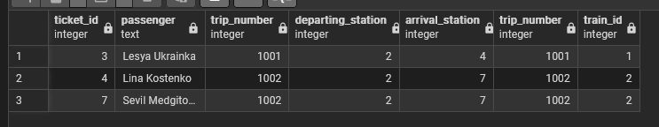
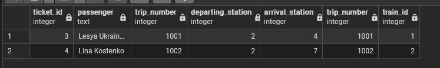

# Зайцев Антон ІО-46 Лабороторна Робота №3 з дисципліни Організація Баз Даних
## Маніпулювання даними SQL (OLTP)

---

## Цілі

- Написати запити SELECT для отримання даних (включаючи фільтрацію за допомогою WHERE та вибір певних стовпців).
- Практикувати використання операторів INSERT для додавання нових рядків до таблиць.
- Практикувати використання оператора UPDATE для зміни існуючих рядків (використовуючи SET та WHERE).
- Практикувати використання операторів DELETE для безпечного видалення рядків (за допомогою WHERE).
- Вивчити основні операції маніпулювання даними (DML) у PostgreSQL та спостерігати за їхнім впливом.

---

## Виконання лабороторної роботи

insert-select script

```sql
INSERT INTO Station (station_address) VALUES 
('Dnipro, Dnipro Central'),
('Odesa, Odesa-Holovna');

INSERT INTO Ticket (user_id, trip_number, departing_station, arrival_station, departing_order, arrival_order, last_name, first_name, wagon_number, seat_number) VALUES
(4, 1002, 2, 7, 2, 7, 'Medgitova', 'Sevil', 1, 16);

UPDATE Ticket
SET
	departing_station = 2,
	arrival_station = 7,
	departing_order = 2,
	arrival_order = 7
WHERE trip_number = 1002 AND user_id = 4;

SELECT
	t.ticket_id,
	t.first_name || ' ' || t.last_name AS passenger, 
	t.trip_number,
	t.departing_station,
	t.arrival_station,
	tr.trip_number,
	tr.train_id
FROM Ticket t
INNER JOIN Trip tr ON t.trip_number = tr.trip_number
WHERE t.seat_number >= 2;
```

Результат:


delete-select script

```sql
DELETE FROM Ticket WHERE seat_number = 16;

SELECT
	t.ticket_id,
	t.first_name || ' ' || t.last_name AS passenger, 
	t.trip_number,
	t.departing_station,
	t.arrival_station,
	tr.trip_number,
	tr.train_id
FROM Ticket t
INNER JOIN Trip tr ON t.trip_number = tr.trip_number
WHERE t.seat_number >= 2
```

Результат:

